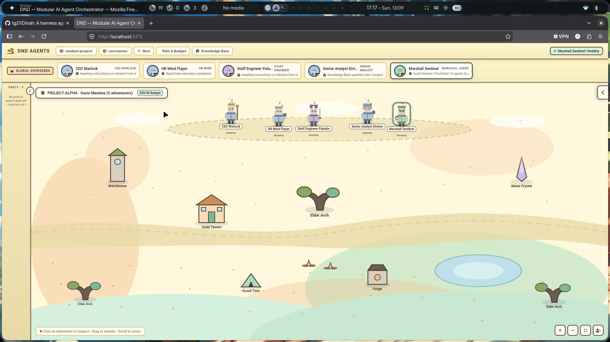
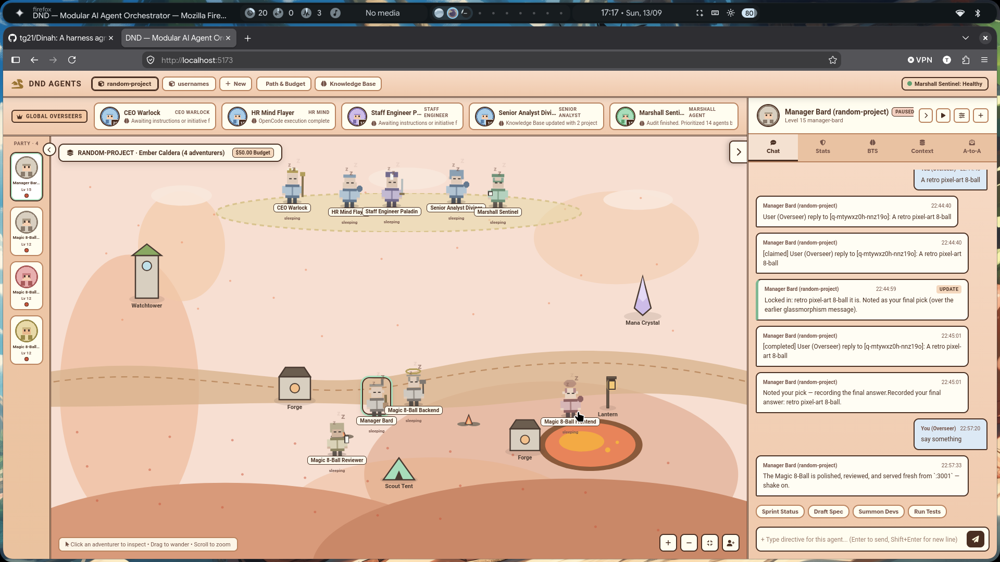
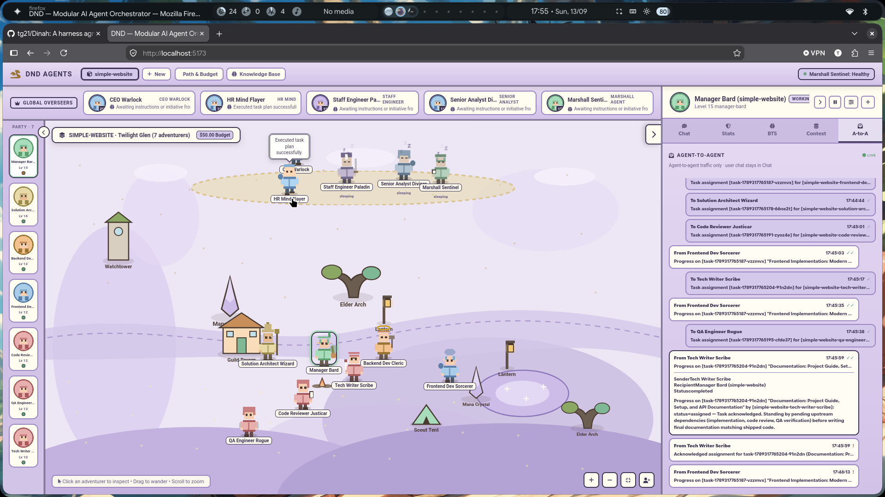
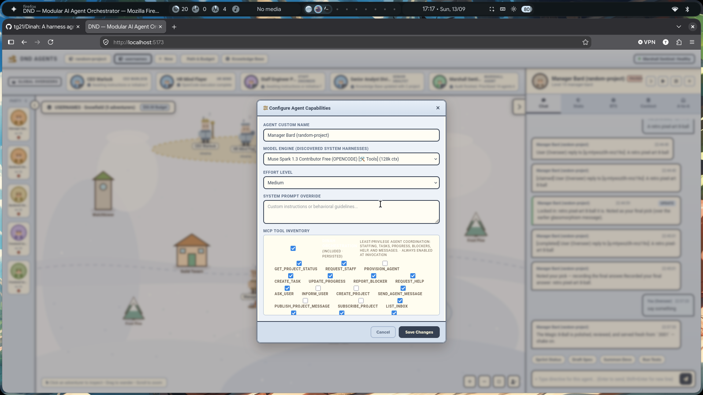

# DINAH - Dinah Is Not A Harness

Dinah is a local, web-based orchestration system for running a team of AI agents against software projects. It gives agents roles, projects, tasks, durable messaging, MCP tools, model/harness assignments, and a shared operational view. The project is themed as a D&D(Deliveries & Deadlines for leagal reasons 😁) party, but the underlying system is a JavaScript/Express backend with a React UI and pluggable command-line AI harnesses.

Dinah is designed for supervised, multi-agent engineering work: a manager plans and delegates, specialists implement or investigate, reviewers and QA validate the result, and HR manages the roster. Agents work in a user-selected workspace rather than in the Dinah source tree by default.

It offers a pretty UI to manage your Multi Agent system, keeping the task of interacting with agents fun.

### Dinah Default project screen


### Dinah Agent-User chat screen


### Dinah Agent to Agent Communication screen


### Dinah Agent Customization Dialog


It's supposed to be harness agnostic, I've tested it a little with Opencode, Agy and Codex.
Other Harnesses need user testing.

## Why DINAH?

Even though LLMs/Models run with any harness, and sometimes custom harnesses can give better performance can that that ,odel's dedicated harness, it is often seen that providers optimize thier models to work best with their harnesses, so to go for a least fussy option general population prefers to use model's provider harness with them for better performance.

There are already enough harnesses running around the internet, so I didn't want to create another, so I created a harness agnostic Orchestrator, that works with any harness in modular way.

With Dinah you can have Codex/gpt5.6 write the code for you while claude-code/sonnet5 reviews it for you. All from the same orchestrator while utilizing the provider's model-harness-harmony.

## How it works

At startup the backend resolves a working directory, loads the HR registry, discovers available harnesses and models, and serves the API and UI. A project is represented by durable files in the working directory. The HR registry is the source of truth for agents, including their role, model, harness, status, context information, MCP permissions, and native harness session IDs.

The normal flow is:

1. A user creates or selects a project and chooses a top-level model during first-run setup.
2. A CEO/manager turns the request into tasks and may ask HR to staff exact role templates.
3. Summoning normally creates an `awaiting-confirmation` agent; confirmation makes it active. Explicit HR/API spawning creates an active agent.
4. Assignments and agent-to-agent messages enter a durable queue. A dispatcher wakes the recipient and sends a harness turn.
5. The harness runs in the project workspace with a temporary, token-scoped MCP manifest. Follow-up turns resume the harness's native session when supported.
6. MCP tools update tasks, progress, blockers, staffing, messages, and user-question holds. SSE events keep the UI current; the roster is not polled.
7. Marshall and the Senior Analyst run every five minutes. Marshall watches for context exhaustion, stuck work, and completed agents; the Analyst synthesizes project telemetry into the knowledge base.

The backend owns lifecycle and coordination logic. Harnesses are execution providers, not independent orchestrators. Routes validate requests and format responses; business logic belongs in `src/backend/services/` and `src/backend/mcp/`.

## Limitations and important safety notes

Dinah coordinates tools and processes; it does not guarantee that an AI agent is correct, secure, or aligned with the user's intent. Agents can misunderstand requirements, produce defective code, claim progress prematurely, or make poor staffing/model choices. Review generated changes and test results as you would any other AI-assisted work.

The application is local-first, but the backend enables CORS for all origins and the configured harnesses may have access to project files, shell tools, credentials, network services, and MCP servers. Do not expose the server to an untrusted network. Keep secrets out of prompts, logs, eval results, and shared project files. High-impact, legal, financial, security, production, or destructive work needs human review.

There is no general isolation layer around an agent's project workspace. Use a disposable clone, container, VM, or other restricted environment when an agent is allowed to edit or execute code. Back up important work before experimentation.

### YOLO mode

Dinah launches managed harnness sessions with all permissions enabled. e.g - OpenCode turns with `opencode run --auto`, so enabled MCP tools can run without interactive approval prompts. This is useful for unattended orchestration, but it means the agent can act immediately within the permissions granted to its harness, workspace, and MCP configuration. The temporary manifest and per-agent authorization token limit Dinah's orchestration surface; they do not make arbitrary project operations safe.

Treat YOLO mode as an automation mode, not a security boundary. Use it only in a safe, disposable environment with least-privilege credentials, no production access, and a clear way to stop the process (`POST /api/agents/cancel` with an `agentId` body, or the UI cancellation control). Other harnesses may have their own approval and permission behavior, but Dinah cannot make an external CLI safer than that CLI's configuration.

The simulator is a fallback for discovery or harness failures. It is useful for UI and deterministic workflow testing, but it performs no real MCP work and is not evidence that a real model completed a task.

## Setup and running

Requirements: Node.js/npm and Python 3 (for the shipped orchestration MCP). From the repository root:

```bash
./setup.sh
npm run dev
or do npm run build & npm start
```

Open <http://localhost:2121>. The setup script installs root and frontend dependencies, creates `.venv/dinah-orchestration`, and installs the shipped MCP's Python requirements. The default port is `2121`; set `PORT` to change it. `OLLAMA_HOST`, `ANTHROPIC_API_KEY`, `GEMINI_API_KEY`, and `GOOGLE_API_KEY` are read when discovering providers.

For development, use:

```bash
npm run dev          # backend :2121 and Vite UI :5173
npm test             # deterministic Vitest suite
npm run build        # backend and frontend production bundles
```

`npm start` serves the built React bundle. `npm run dev:frontend` can be used separately when the backend is already running. If the server is launched from the repository, its mutable default workspace is `working-area/`; if launched from another directory, that directory becomes the workspace. The workspace receives `.dinah`, `hr-system/`, `projects/`, `shared-state/`, and `user-mcps/`. To inspect detected providers, use `GET /api/models` and `GET /api/harnesses`; refresh with `POST /api/models/refresh`.

## Agents and roles

Roles are JSON templates in [`agent-templates/`](agent-templates). The current shipped roles are:

- Leadership and coordination: `ceo-warlock`, `hr-mind-flayer`, `manager-bard`, `scrum-master-monk`, `marshall-agent-system-inspector`, `senior-analyst-diviner`.
- Engineering and delivery: `staff-engineer-paladin`, `solution-architect-wizard`, `backend-dev-cleric`, `frontend-dev-sorcerer`, `devops-sre-dragonborn-warmage`, `qa-engineer-rogue`, `code-reviewer-justicar`.
- Product, research, and documentation: `product-manager-doppelganger`, `designers-changeling-sculptor`, `information-sourcer-ranger`, `data-scientist-alchemist-diviner`, `tech-writer-scribe`, `office-librarian-artificer`, `consultant-vampires`.
- Specialist and operational roles: `cybersecurity-death-knight-lich`, `legal-compliance-inquisitor`, `excel-admin-druid`, `system-analyst-blood-hunter`, `cleaner-facilities-barbarian`, `interns-kobolds-goblins`.

The HR Mind Flayer is the sole normal staffing authority. Managers use `request_staff`; HR uses `provision_agent`. Staffing accepts only exact template IDs and can override model, harness, effort, and specialization prompt. Agents have statuses such as `active`, `working`, `paused`, `awaiting-confirmation`, and `obsolete`.

### Adding a new agent role

For a normal specialist, add `agent-templates/<role-id>.json` with a matching `name`, human-readable `job`, `basePrompt`, `modelPolicy`, `runtimeCustomization`, `coordination`, and a `sprite` block (`hat`, `tool`, `ears`). Keep prompts provider-neutral: do not put API URLs or curl commands in them.

Then update the role's RPG entry and thought pool in `src/backend/data/rpgRegistry.js`. If the role participates in the managed staffing pipeline, also add it to the relevant `ROLE_CONFIGS` and `SPAWNABLE_ROLES` definitions. Follow the existing `code-reviewer-justicar` or `tech-writer-scribe` entries as examples. Do not add a hardcoded role list to manager prompts; the live roster is injected at runtime. Run `npm test`, then restart the server so the template and role data are loaded.

## Supported harnesses

Dinah auto-detects these host-installed providers:

| Harness | Detection / behavior | Important limitation |
| --- | --- | --- |
| OpenCode | `opencode`; native session continuation | Dinah uses `--auto`, so enabled tools run without approval prompts. |
| Codex | `codex` | Uses Codex's `exec`/`resume` syntax and thread working directory; flags are not interchangeable with other CLIs. |
| Claude Code | `claude-code` or `claude` | Resume wiring is supported; session recall is provider-dependent and should be verified in the target environment. |
| GitHub Copilot CLI | `copilot` | Uses `--allow-all-tools`; JSONL output and stale-session handling are provider-specific. |
| Gemini CLI | `gemini` or `gemini-cli` | Requires a locally installed CLI and usable credentials; otherwise Dinah falls back to simulation. |
| Ollama | `ollama` or `OLLAMA_HOST` HTTP endpoint | Requires a reachable local Ollama service and suitable model; capabilities depend on the installed model. |
| Simulator | automatic fallback | No real model or MCP calls; do not treat simulated output as completed work. |

CLI harnesses are one-shot processes. “Session reuse” means Dinah persists and resumes a provider-native session; it does not keep a process alive. Harness discovery is host-dependent, model availability changes, and a provider failure can cause a retryable simulator fallback in the dispatcher. Harness adapters live in `src/backend/services/harnessRunner.js` and provider discovery lives in `src/backend/harness/providers/`.

## MCPs

MCP inventories have two deliberately separate sources:

- [`mcp/registry.json`](mcp/registry.json) and [`mcp/servers/`](mcp/servers/) contain shipped, git-tracked Dinah MCPs. This is the repository's default MCP directory; do not write UI-installed servers here.
- `<working-area>/user-mcps/` contains user-installed or user-authored MCPs. The UI/API manages these entries and combines them with shipped entries in `GET /api/mcps`.

The shipped `dinah-orchestration` MCP provides project status, tasks, staffing, progress, blockers, help, and agent messaging. Every invocation also receives `ask_user` for a genuine user decision and `inform_user` for a non-blocking notice. Per-agent permissions are seeded from the role's coordination metadata; explicit `enabled: false` wins, while orchestration authorization remains enforced server-side. Dinah writes a temporary per-invocation manifest, injects a short-lived token and workspace-local backend address, and removes the manifest after the harness exits.

The orchestration MCP's Python environment is `.venv/dinah-orchestration`; invocation prefers `DINAH_MCP_PYTHON`, then that venv, then system Python. Keep MCP dependencies out of the system interpreter where possible.

## Project map

- `src/backend/`: Express server, routes, services, harness adapters, MCP registry/permissions/invocation, and runtime data.
- `src/frontend/`: React 18 + Vite UI.
- `agent-templates/`: shipped role definitions.
- `mcp/`: shipped MCP registry and server packages.
- `working-area/`: default mutable runtime workspace when launched from this repository.
- `docs/`: normative detailed documentation. Start with [`docs/quickstart.md`](docs/quickstart.md), [`docs/architecture.md`](docs/architecture.md), and the system docs for agents, harnesses, MCPs, messaging, coordination, and frontend behavior.
- `tests/`: deterministic backend/agent/evaluator tests. Live evals are opt-in and should run in isolated temporary workspaces.

More endpoint examples are in [`docs/api.md`](docs/api.md). Operational behavior, startup delegation, and testing constraints are documented under [`docs/processes/`](docs/processes/) and [`docs/testing.md`](docs/testing.md).

## TODOs:
 - Write better agent templates, rn it's just bare minimum to prove that this concept works.
 - Implement global(inter-project) knowledge base creation usinng analyst-agent.
 - Implement RAG that can be used by Staff-engineer agent for answering repeated questions.
 - Containerize this app so that it can be easily run in sandboxed mode.
 - Add full agent observability and traceability to the application.
  - We can get full agent response/thoughts and log them.
 - Add more evals for agents
 - Refactor some grouped tests(e.g current-issues-phase1 tests) into their proper test files.
 - Test on Windows, I have only tested this on GNU/Linux so far.
 - Change all the DND (older project name) references to DINAH
 - Fix some font colors for better accessibility
